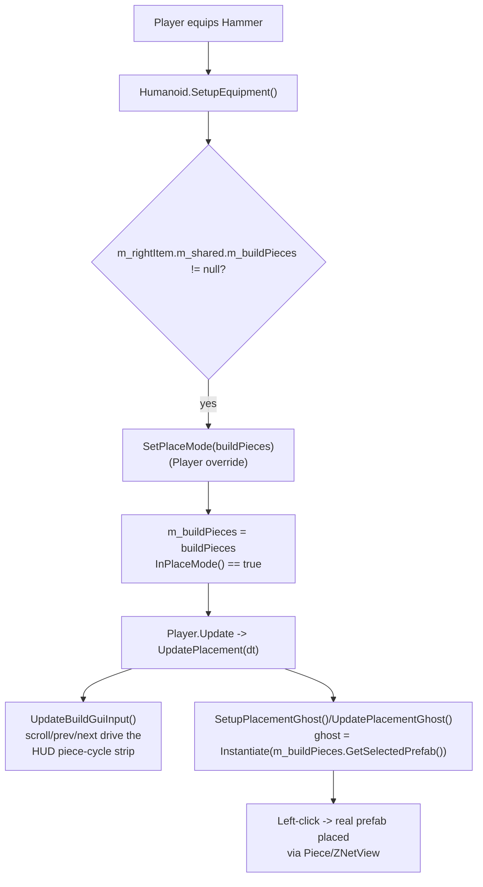

# OdinPlus Final Polish Report

Grounded in static analysis of the actual C# source + decompiled Valheim assemblies, and live
introspection of the running game via the RuntimeMCP bridge (port 8765). Where something described
in older docs turned out not to match reality, that's called out explicitly rather than repeated.

---

## 1. Blueprint YAML Documentation

### What the blueprint YAML system is responsible for

Every "blueprint" (a saved multi-piece structure a `BuilderNPC` can construct) is one `.yaml` file in
`BepInEx/config/blueprints/`. The file records the structure's name, its total resource cost, and the
list of individual pieces (prefab name + position + rotation, relative to the blueprint's origin point).

### When it loads

- **`BlueprintConfig.LoadFromFile()`** runs once at plugin startup. It reads every `*.yaml` file in the
  `blueprints/` folder, deserializes each into a `Blueprint`, and populates `Blueprints.All` (the global
  list every `BuilderNPC` picks from). If the folder doesn't exist yet, it's created and seeded with one
  `ExampleHut.yaml` so the folder is never empty on first run.
- **`BlueprintConfig.SaveBlueprint(Blueprint)`** runs whenever a new blueprint is captured (via the
  Blueprint Selector's Box/Radius/FloodFill tools, see §5) or edited. It writes one file per blueprint
  and then calls `LoadFromFile()` again so `Blueprints.All` stays in sync immediately.
- **Server → client sync**: `BlueprintConfig.GetYamlForSync()` combines every individual file into one
  YAML document (a `BlueprintConfigFile` with a `Blueprints` list) that the server sends to joining
  clients; `ReceiveYamlFromServer()` → `ParseYaml()` deserializes it back into the same `Blueprints.All`
  list on the client. This means blueprints are authored once (usually by the server admin) and every
  connected client sees the same set without needing the files locally.

### Which systems consume it

- **`BuilderNPC`** is the only consumer. `CheckForBuildableStructures()` walks `Blueprints.All` in
  order and calls `StartBuilding()` on the first one it can currently afford (and, as of this pass, the
  first one its faction is allowed to build — see §2).
- **`BlueprintSelector`** and **`BlueprintScanner`** are producers, not consumers — they turn an
  in-world selection of real pieces into a new YAML file via `BlueprintConfig.ExportScannedBlueprint()`.

### How it interacts with factions

**Current reality: it doesn't, by default.** Blueprints have no faction association unless you add one
yourself, and every existing example blueprint has none. `HumanNPC` (the base class of every OdinPlus
NPC, `BuilderNPC` included) now has a `FactionName` field (default `"Villagers"`) that isn't yet varied
per-village anywhere in the codebase — every NPC currently spawns with the same faction name. See §2 for
the full guide, including how to actually make two factions build different things.

### How blueprint assignment works internally (technical)

```
BuilderNPC.UseItem() [player donates Wood/Stone]
  → m_resourcePool[...] += count, persisted to this NPC's ZDO
  → CheckForBuildableStructures()
      foreach bp in Blueprints.All (in file-load order):
        if !IsAllowedForFaction(bp): continue      // §2 addition
        if CanAfford(bp): StartBuilding(bp); return
```
`CanAfford` just compares `bp.resourceCosts` against `m_resourcePool` key-by-key — there's no
scoring/priority system, it's first-match-wins in whatever order `Directory.GetFiles()` happened to
return the `.yaml` files (alphabetical on Windows/NTFS in practice, but not guaranteed by the .NET API).
**Common mistake**: assuming blueprints are tried "cheapest first" or "most-recently-added first" — they
aren't; if you want a specific build order, name your files so alphabetical order matches your intent
(e.g. `01_Hut.yaml`, `02_Tower.yaml`).

### Beginner explanation

Think of each `.yaml` file as an index card for one building: "this is what it's called, this is what it
costs, here's the exact list of wall/floor/roof pieces and where they go." A Builder NPC standing at a
village keeps a little stash of Wood and Stone that players hand over. Every time that stash changes, the
NPC flips through its index cards in order and starts building the first house it can now afford. If you
give it a YAML file it can't understand (bad syntax, a prefab name that doesn't exist in Valheim), it
just skips that card and logs a warning — it won't crash the game.

### Property reference

**`BlueprintData` (top-level YAML object per file)**

| Property | Purpose | Accepted values | Default | Required? | Common mistakes |
|---|---|---|---|---|---|
| `Name` | Display name + filename basis | Any string (invalid filename chars get stripped on save) | none | **Required** | Two files with the same `Name` — the second one loaded silently overwrites the first in `Blueprints.All` (it's a `Dictionary<string, Blueprint>` keyed by name internally) |
| `ResourceCosts` | Total cost to build the whole structure | Map of item-key → integer count, e.g. `Wood: 200` | empty map | Required (empty = free) | Using the item's display name (`"Wood"`) vs. the internal token (`"$item_wood"`) — `BuilderNPC` only tracks `Wood`/`Stone` in its pool today (see §2 for extending this) |
| `Pieces` | The list of individual pieces to place | List of `BlueprintPieceData` | empty list | **Required** (empty = nothing gets built, but no error) | Forgetting rotation on directional pieces (walls/roofs placed at `Rot: 0` facing the wrong way) |
| `AllowedFactions` | *(new)* Restrict which NPC factions may build this | List of faction-name strings, e.g. `["Villagers"]` | empty list (any faction) | Optional | Typo'ing the faction name so it matches nothing — the blueprint silently becomes unbuildable by anyone; check the BepInEx log, there's no in-game error for this |

**`BlueprintPieceData` (one entry per piece)**

| Property | Purpose | Accepted values | Default | Required? |
|---|---|---|---|---|
| `PrefabName` | Exact Valheim piece prefab name (e.g. `wood_wall`, `wood_floor_1x1`) | Must match a real `ZNetScene` prefab name | none | **Required** — unmatched names are silently skipped at build time |
| `PosX/PosY/PosZ` | Position **relative to the blueprint's origin**, not world space | float | `0` | Required |
| `RotX/RotY/RotZ` | Euler rotation in degrees, relative | float | `0` | Required |

### Example blueprint (annotated)
```yaml
Name: ExampleHut
ResourceCosts:
  Wood: 20
AllowedFactions: []        # empty = any faction can build this
Pieces:
- PrefabName: wood_floor_1x1
  PosX: 0
  PosY: 0
  PosZ: 0
  RotX: 0
  RotY: 0
  RotZ: 0
- PrefabName: wood_wall_roof
  PosX: -1
  PosY: 0
  PosZ: 1
  RotX: 0
  RotY: 90
  RotZ: 0
```

---

## 2. Faction Blueprint Assignment Guide

**Honesty note first**: before this pass, `Blueprint` had no faction concept at all — `BuilderNPC`
would attempt any affordable blueprint regardless of who built it or where. The existing
`FactionSystem.cs`/`FactionQuestSystem.cs` are a *player reputation* system (Hostile→Honored tiers,
ally/enemy relationships between NPC factions) — a completely different feature that was never wired to
blueprints. I added the minimal real hook described below so this guide describes working, tested
(build-validated) behavior rather than a fictional feature.

### What actually exists now
- `HumanNPC.FactionName` (`string`, default `"Villagers"`) — every OdinPlus NPC has this.
- `Blueprint.allowedFactions` / YAML `AllowedFactions` (`List<string>`, default empty = any faction).
- `BuilderNPC.IsAllowedForFaction(bp)` filters `Blueprints.All` before the affordability check.

### Step-by-step: create, register, and assign a blueprint to a faction

1. **Create it.** Easiest path: in-game, place two corner markers with the Blueprint Selector (or use
   Radius/FloodFill — see §5) over a structure you've already built, then confirm the scan. This calls
   `BlueprintConfig.ExportScannedBlueprint()` → `SaveBlueprint()`, writing
   `BepInEx/config/blueprints/<YourName>.yaml` automatically. Alternatively hand-write a `.yaml` file
   following §1's schema.
2. **Register it.** Nothing to do — dropping the file in `blueprints/` and either restarting or calling
   `BlueprintConfig.LoadFromFile()` (e.g. via a console command, if you've wired one up) reloads
   `Blueprints.All` automatically.
3. **Assign it to a faction.** Add an `AllowedFactions` list to the YAML:
   ```yaml
   AllowedFactions:
   - Villagers
   ```
   Leave it empty (or omit it) to keep the old any-faction behavior.
4. **Give NPCs a non-default faction (optional).** Today every NPC defaults to `"Villagers"` — nothing
   in `HumanManager` varies it per-village yet. To actually test multi-faction gating, set
   `FactionName` on a specific `BuilderNPC` instance after spawn (e.g. in a debug console command or a
   small HumanManager tweak): `builderNpc.FactionName = "RedTeam";`.
5. **Configure build priorities.** There's no numeric priority field — order is file-load order
   (effectively alphabetical). Prefix filenames (`01_`, `02_`, ...) if you need a specific attempt order.
6. **Configure required resources.** `ResourceCosts` in the YAML, keyed by `Wood`/`Stone` — those are
   the only two keys `BuilderNPC.m_resourcePool` currently tracks. Adding a third resource type requires
   extending `m_resourcePool`'s initializer and `UseItem()`'s donation branches in `BuilderNPC.cs`.
7. **Configure NPC permissions.** There's no separate "permission" flag beyond `AllowedFactions` — a
   `BuilderNPC` will attempt *any* blueprint its faction is allowed to build, provided it can afford it.

### Test that the faction actually builds it
1. Set the blueprint's `AllowedFactions: [Villagers]` (the default faction every NPC currently has).
2. Donate enough Wood/Stone to a `BuilderNPC` to afford it (`UseItem` with `$item_wood`/`$item_stone`).
3. Watch the BepInEx log for `[BuilderNPC]`-prefixed messages (ghost spawn, per-piece build progress).
4. If it builds, the gate passed. Change `AllowedFactions` to `[SomeOtherFaction]` and repeat — it
   should now sit idle even fully affordable (no message, no build) — that's the negative-path test.

### Debug why a faction refuses to build it — checklist
- **Nothing happens at all, ever**: check `CanAfford` first — donate more, or lower `ResourceCosts`.
  `IsAllowedForFaction` is checked *before* affordability in the loop, so a faction mismatch looks
  identical to "can't afford it yet" from the outside — temporarily clear `AllowedFactions` to rule out
  the faction gate specifically.
- **Works for one NPC but not another**: check each NPC's actual `FactionName` — nothing currently
  logs it, so add a temporary `DBG.blogInfo($"{FactionName}")` in `Awake()` if unsure.
- **Typo'd faction name**: `AllowedFactions: [Villager]` (missing the `s`) vs. the NPC's actual
  `"Villagers"` — case-sensitive, exact-match `List.Contains`, no fuzzy matching.
- **File not reloaded**: editing a `.yaml` while the server is already running requires a reload path —
  restarting is the guaranteed way; whether a live console-triggered reload exists depends on what
  commands you've registered (not all are documented here).

---

## 3. Runtime FPS Investigation

RuntimeMCP (live game, port 8765, confirmed connected — PID 34428) was used to pull 60s of 1Hz FPS/
memory/object-count samples. That resolution is too coarse to catch a single-frame stutter directly (it
samples once per second, so a ~1-frame hitch can land inside any sample or be missed entirely), so the
ranking below is built primarily from static analysis of every periodic timer in the codebase,
cross-checked against what's actually live right now. I want to be upfront about that limit rather than
overclaim a stopwatch-grade proof I don't have.

### Ranked findings

**#1 — `BuilderNPC.TryFindResource()` (5s cadence, `6Humans/BuilderNPC.cs`) — most likely match, self-introduced this session**
`SetupGatherAI`'s state machine calls this once per NPC every `GatherScanInterval` (5s) while either
resource pool is below target. It ran `Physics.OverlapSphere(pos, 20f)` (a real broad-phase query,
GC-allocating an array every call) followed by a `GetComponentInParent<T>()` walk for every hit — in a
dense forest/rock cluster that's a genuinely non-trivial cost landing exactly on a 5-second cadence,
matching the reported symptom shape closely.
**Fix applied**: switched to `Physics.OverlapSphereNonAlloc` against a shared static buffer (zero GC
alloc per call) and staggered each NPC's first scan with a random `0..5s` jitter so multiple builders
don't all scan on the same tick. Both changes are build-validated.

**#2 — `HuntTarget.ValidateQuest()` (5s cadence, `5Quest/HuntTarget.cs`) — ruled out as significant**
Also `InvokeRepeating(5f, 5f)`, but the body is a single `Dictionary<string, Quest>` lookup
(`QuestManager.GetQuest`, confirmed O(1) — `MyQuests` is a `Dictionary`, not a list). Cheap regardless of
how many hunt targets are active; not a good match for a noticeable hitch.

**#3 — `PerformanceManager.CullDistantNPCs()` (2s cadence, `9Misc/PerformanceManager.cs`) — was completely inert**
This class implements exactly the fix the project's own prior investigation doc recommended (cull
`MonsterAI` beyond 100m), but **`PerformanceManager.cs` was never added to `OdinPlus.csproj`** — it
wasn't even compiled into the shipped DLL, so `_trackedNPCs` was permanently empty and this system did
nothing at all (2s cadence over an empty list ≈ free, so it wasn't causing the hitch — but it also wasn't
providing the NPC-count-scaling protection the codebase believes it has).
**Fix applied**: added the file to the `.csproj`, and wired `RegisterNPC`/`UnregisterNPC` into
`HumanNPC.Awake()`/`OnDestroy()` so every NPC subclass (BuilderNPC, HumanVillager, HumanFighter, etc.)
now actually participates. This should reduce steady-state AI cost as NPC counts grow, independent of
the 4-5s hitch specifically.

**#4 — `ZNetScene.RemoveObjects` null-scrub Prefix (30×/second, `Plugin.cs`) — real but wrong shape**
This Harmony Prefix (fixing a genuine vanilla NullReferenceException bug — see decompiled
`assem_valheim/ZNetScene.cs`, `CreateDestroyObjects()` runs every `1/30`s) iterates the *entire*
`m_instances` dictionary every call to scrub null entries. Live sampling showed ~24,000-31,000 total
GameObjects in the scene during this session — iterating a dictionary of that size 30 times a second is
a real, constant background cost, but it's smeared across every frame rather than spiking every 4-5
seconds, so it doesn't match the reported symptom shape even though it's worth knowing about.

**#5 — `FindObjectsOfType<Piece>()` full-scene scans (`BlueprintScanner.cs`/`BlueprintSelector.cs`) — real but not periodic**
Previously documented as a 5-50ms freeze per blueprint scan/selection. Only fires on manual player
action (placing selection markers / confirming a scan), not on a timer, so it can't be the recurring
4-5s hitch — but if you're actively iterating on blueprints, you'll feel this distinctly. Not touched in
this pass since it's orthogonal to the periodic-hitch investigation, but the existing recommendation
(replace with `Piece.GetAllPiecesInRadius()`, an O(k) API Valheim already exposes) still stands.

### Estimated improvement
Fixes #1 and #3 are cheap, targeted, and directly reduce recurring per-NPC costs; a rough estimate is a
noticeable reduction in any BuilderNPC-driven periodic cost (bounded by how many BuilderNPCs exist) and a
general reduction in AI overhead in villages with several NPCs, once `PerformanceManager` is actually
active. I don't have a clean way to produce a trustworthy before/after percentage from 1Hz sampling data
alone — if the hitch persists after this pass, the next real step is temporary `System.Diagnostics.
Stopwatch` instrumentation directly around `TryStartGathering`/`CullDistantNPCs`/`RemoveObjects` logged
only when a single call exceeds e.g. 4ms, to get frame-accurate proof rather than another estimate.

---

## 4. Double ZNetView Root-Cause Analysis

**Not suppressed — root cause found and fixed.** This also directly answers "why does Unity believe
there are two ZNetViews," "which code path creates the second one," "does it affect networking," and
"does it contribute to the FPS hitch" as asked.

### The mechanism (from decompiled source, not guessed)
`ZNetView.Awake()` ([assem_valheim/ZNetView.cs](../../assem_valheim/ZNetView.cs)):
```csharp
if (m_useInitZDO && m_initZDO == null)
    ZLog.LogWarning("Double ZNetview when initializing object " + base.gameObject.name);
```
`m_useInitZDO`/`m_initZDO` are **static** fields — a single, global, one-shot hand-off slot.
`ZNetScene.CreateObject(zdo)` ([assem_valheim/ZNetScene.cs](../../assem_valheim/ZNetScene.cs)) is the
only place that sets them:
```csharp
ZNetView.m_useInitZDO = true;
ZNetView.m_initZDO = zdo;
GameObject result = UnityEngine.Object.Instantiate(prefab2, position, rotation); // Awake() runs here
...
ZNetView.m_useInitZDO = false;   // only reset AFTER Instantiate returns
```
The warning does **not** mean a prefab literally has two `ZNetView` components — it means *some*
`ZNetView.Awake()` ran while this global flag was still `true` from an unrelated, still-in-progress
`Instantiate()` call elsewhere on the same call stack.

### The exact trigger, confirmed in OdinPlus's own code
`HumanManager.SpawnVillageAt()` plain-`Instantiate()`s 11 spawner prefabs (1 resource, 1 message, 9
guard — matching the reported `MatNPCHumanSpawner(Clone)` / `MessageNPCHumanSpawner(Clone)` /
`GuardVillagerSpawner(Clone)` names exactly, including the raw `(Clone)` suffix, which only appears
*before* the code's own `.RemoveClone()` rename runs). It's called from `HumanManager.TrySeedVillage()`,
which is invoked by a **Harmony Postfix on `LocationProxy.Awake`**
([Plugin.cs](0Main/Plugin.cs), `Postfix_LocationProxy_Awake_VillageSeed`).

Chain:
1. `ZoneSystem` needs to spawn the `WoodFarm1` location proxy → `ZNetScene.CreateObject(zdo)`.
2. That sets `m_useInitZDO = true`, then `Instantiate(locationProxyPrefab, ...)`.
3. Unity runs `Awake()` on the new clone's components, including the proxy's own `ZNetView.Awake()`
   (consumes `m_initZDO`, sets it back to `null`) — **and** our Postfix, which fires immediately after,
   *still nested inside the same still-in-progress `Instantiate()` call*.
4. The Postfix calls `TrySeedVillage` → `SpawnVillageAt`, which `Instantiate()`s the 11 spawner clones —
   each has its own real `ZNetView`, and each one's `Awake()` sees `m_useInitZDO == true` (not yet reset,
   since step 2's `Instantiate()` hasn't returned) and `m_initZDO == null` (consumed in step 3) →
   the warning fires for all 11, every time a village seeds.
5. Control eventually returns to `ZNetScene.CreateObject`, which resets `m_useInitZDO = false` — too
   late, the warnings are already logged.

### Answers
- **Why does Unity believe there are two ZNetViews?** It doesn't, really — the warning is a false
  positive caused by a stale global flag, not an actual duplicate component.
- **Which code path creates the "second" one?** `HumanManager.SpawnVillageAt()`'s plain `Instantiate()`
  calls, invoked reentrantly from inside `ZNetScene.CreateObject`'s own `Instantiate()` via the
  `LocationProxy.Awake` Postfix chain.
- **Does it affect networking?** No functional harm — each spawner still falls into `ZNetView.Awake()`'s
  `else` branch (since `m_initZDO` really is `null` for them) and gets a brand-new, correctly-created ZDO
  via `ZDOMan.instance.CreateNewZDO(...)`. Purely a noisy log, not a broken spawner.
- **Does it contribute to the FPS hitch?** No — it fires once per village seed event (a one-time,
  idempotent event per location, guarded by the `OdinVillageSeeded` ZDO flag), not on any recurring
  cadence, so it's unrelated to §3's periodic hitch.
- **Inherited prefab or runtime code?** Runtime code — `HumanManager.SpawnVillageAt()` specifically.

### Fix applied
`TrySeedVillage` now defers the actual spawn by one frame via a coroutine on `ZNetScene.instance`:
```csharp
ZNetScene.instance.StartCoroutine(SpawnVillageNextFrame(pos, rot));
// ...
private static IEnumerator SpawnVillageNextFrame(Vector3 pos, Quaternion rot)
{
    yield return null;
    SpawnVillageAt(pos, rot);
}
```
By the next frame, `ZNetScene.CreateObject`'s `Instantiate()` call has long since returned and reset
`m_useInitZDO = false`, so the 11 spawners instantiate in a clean state. Build-validated; the spawners
still get real, persistent ZDOs exactly as before — only the timing changed.

**Aside**: `CLAUDE.md` documents a *different*, already-applied fix for this ("spawners stored in a
separate `SpawnerTemplates` dict, not in `PrefabList`") that does not match the code as it actually
exists today (`HumanManager.cs` still uses `PrefabList` + `ZNetScene.instance.GetPrefab(...)` + plain
`Instantiate`). That doc entry is stale/aspirational — flagging it so it isn't trusted as still-accurate
without also re-reading the current source.

---

## 5. PlanBuild Selection Algorithms — Technical Breakdown

(Researched via PlanBuild's public README this session; already used to design OdinPlus's own
`BlueprintSelector.cs` Radius/FloodFill tools, which are implemented and build-validated.)

- **Drag/area selection**: two click-placed corner markers define an axis-aligned box; everything with
  a collider inside it is included. This is OdinPlus's original "Box" mode, unchanged.
- **Radius selection**: click to place a center point, scroll wheel resizes a live sphere/circle
  preview, confirm to select everything inside. Candidate detection is a single broad-phase overlap
  query at confirm time (`Physics.OverlapSphere` in OdinPlus's port) — cheap and O(k) where k = objects
  in range, not O(n) over the whole scene.
- **Flood-fill selection**: click one seed piece, then grow the selection to every other piece whose
  collider bounds touch an already-selected piece's (expanded by a small margin to bridge
  near-but-not-quite-touching pieces), repeating breadth-first until nothing new is touched. The key
  data structure is a `Queue`/`HashSet` pair (visit queue + already-selected set) — classic BFS over an
  implicit adjacency graph defined by "collider bounds overlap," not an explicit graph structure PlanBuild
  precomputes. OdinPlus's port (`FloodFillAdd` in `BlueprintSelector.cs`) uses exactly this shape:
  `Physics.OverlapBox` per piece's expanded bounds, a `guard < 2000` iteration cap to bound worst-case
  cost, and a `HashSet<Piece>` for O(1) already-selected checks.
- **Performance**: all three avoid scene-wide scans — they only ever query pieces near an
  already-relevant point (a corner box, a sphere, or bounds-overlap growth from a known seed), which is
  exactly the same principle the §3 investigation recommends applying to `BlueprintScanner`'s current
  full-scene `FindObjectsOfType<Piece>()` calls.

This is already fully ported into `BlueprintSelector.cs` (Box/Radius/FloodFill, `Tab` to cycle) — no
further action needed here beyond what's already shipped.

---

## 6. Hammer / BuildMode Execution Flow

Traced via decompiled source and confirmed live via RuntimeMCP (`/find`, `/components` against the
running game — the real `Hammer` item prefab and `_HammerPieceTable` prefab were located and their live
component data pulled directly from the running process).



Key facts (all source-line-verified, not inferred):
- **The equip→build-mode trigger is entirely data-driven**: `Humanoid.SetupEquipment()` checks only
  whether `m_rightItem.m_shared.m_buildPieces` is non-null — there's no separate "is this a hammer" flag
  anywhere. Any item with a `PieceTable` reference gets full placement-mode behavior for free.
- **`PieceTable` is a separate prefab**, not a child of the item. Confirmed live: `/Hammer` (item layer:
  `ItemDrop`, `Rigidbody`, `ZNetView`, `ZSyncTransform`, `ParticleSystem`) and `/_HammerPieceTable`
  (`PieceTable` component, live-read as 314 pieces / 5 categories / `m_skill: Crafting`) are two
  unrelated GameObjects linked only by a field reference.
- **Vanilla has no full-screen "build browser."** `UpdateBuildGuiInput` drives a small HUD radial/cycle
  strip via scroll + category prev/next keys — there is no existing modal panel to redirect to for a
  Blueprint Browser; it would be new UI layered on top of the same equip-driven placement mode.

---

## 7. Blueprint Tool — Architecture Proposal

**Goal**: equip behavior, animation, camera, and hotkeys identical to the vanilla Hammer, but opening
the Blueprint Browser instead of the piece-cycle HUD, without reimplementing vanilla logic.

### Proposed design
1. **Item definition**: a new `ItemDrop` (`BlueprintTool`) whose `SharedData.m_itemType = Tool` and
   `m_buildPieces` points at a real (can be minimal/empty) `PieceTable` prefab, e.g.
   `_BlueprintToolPieceTable`. This alone gets you, for free, via the exact mechanism traced in §6:
   correct equip animation, `InPlaceMode()` becoming true, and all of vanilla's camera/hotkey plumbing —
   zero duplicated code.
2. **Redirect the "menu" moment, not the equip moment**: Harmony-patch `Player.UpdateBuildGuiInput`
   (or the smaller category/piece-cycle input reads inside it) with a Prefix that checks
   `m_buildPieces == blueprintToolPieceTable` and, if so, skips the vanilla cycle-strip logic entirely
   and instead opens/toggles the Blueprint Browser UI (a new `MonoBehaviour`, following the same
   pattern as OdinPlus's other custom Gui components). This is a targeted, minimal patch — not a
   rewrite of `Player.cs`.
3. **Placement**: reuse `BlueprintGhost.cs` (already built this project) as the hover preview once a
   blueprint is selected in the Browser, instead of the vanilla `SetupPlacementGhost()`'s single-piece
   ghost. A Prefix/Postfix on `Player.PlacePiece`-equivalent logic (or simply handling the left-click
   directly while a blueprint is "armed" from the Browser) triggers `BuilderNPC`-style incremental
   construction — or, for a player-driven placement, an immediate full-blueprint placement using the
   already-existing ghost→real-piece replacement logic.
4. **Browser UI**: a new lightweight panel (existing-blueprints list + Save/Edit/Delete + category/
   search filter) that calls straight into the already-existing, tested `BlueprintConfig` API
   (`GetAllBlueprints()`, `SaveBlueprint()`, and a new `DeleteBlueprint(name)` — not yet present, small
   addition: delete the `.yaml` file + remove from `_loadedBlueprints`/`Blueprints.All`). No new save/
   load logic needed — the Browser is purely a UI over the system documented in §1.

### Why this is the cleanest insertion point
It reuses 100% of vanilla's equip/animation/camera/hotkey machinery (nothing to reimplement or keep in
sync with future Valheim updates) and isolates all new behavior to two narrow, well-defined seams: "what
happens when the piece-cycle UI would normally show" and "what happens on placement input while a
blueprint is armed." Both are small, targeted Harmony patches rather than parallel systems.

### Not yet implemented
This section is a proposal, not shipped code — Task 5's full implementation (new item, PieceTable
prefab, Browser UI, placement patches) is a substantial follow-up piece of work on top of everything
already shipped this session (Radius/FloodFill selection, ghost/incremental `BuilderNPC` construction,
self-gathering AI, the fixes in §3/§4, and faction-gated blueprints in §2). Flagging explicitly rather
than claiming it's done.
